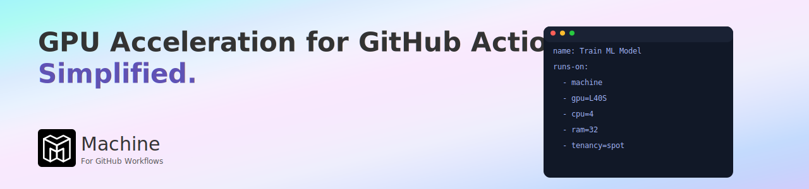

[](https://machine.dev/)

Machine supercharges your GitHub Workflows with seamless GPU acceleration. Say goodbye to
the tedious overhead of managing GPU runners and hello to streamlined efficiency. With Machine,
developers and organizations can effortlessly scale their AI and machine learning projects,
shifting focus from infrastructure headaches to innovation and speed.


# Language Model Arena

Compare open weight Language Models on a set of benchmarks.

We use the [lm-evaluation-harness](https://github.com/EleutherAI/lm-evaluation-harness)
to compare the performance of different models on a set of benchmarks.

## LLM Evaluation Benchmarking

Why might you want to evaluate a language model?
 
There are many reasons, but here are a few:

- You want to know how well your model performs on a specific task.
- You want to compare the performance of different models on a specific task.
- You want to know which model is best suited for a specific task.


## How this repo works

We can run this workflow in the Actions tab here in Github. The workflow has been configured 
to respond to a [workflow dispatch](https://docs.github.com/en/actions/writing-workflows/choosing-when-your-workflow-runs/events-that-trigger-workflows#workflow_dispatch)
event so that it can be triggered manually via the UI.

The workflow is defined in the `.github/workflows/llm-eval-benchmark.yaml` file:

```yaml
name: LM Eval Benchmarking

on:
  workflow_dispatch:
    inputs:
      model_1:
        type: string
        required: false
        description: 'The first model to benchmark'
        default: 'Qwen/Qwen2.5-3B-Instruct'
      model_1_revision:
        type: string
        required: false
        description: 'The first model revision to benchmark'
        default: 'main'
      model_2:
        type: string
        required: false
        description: 'The second model to benchmark'
        default: 'unsloth/Llama-3.1-8B-Instruct'
      model_2_revision:
        type: string
        required: false
        description: 'The second model revision to benchmark'
        default: 'main'
      tasks:
        type: string
        required: false
        description: 'The tasks to benchmark'
        default: 'hellaswag,arc_easy,mathqa,truthfulqa,drop,arc_challenge,gsm8k,mmlu_abstract_algebra,mmlu_college_mathematics'
      examples_limit:
        type: string
        required: false
        description: 'The number of examples to use for benchmarking'
        default: '100'
```

Here we define the inputs that we can pass to the workflow when we trigger it. We can specify the models
we want to compare, the revisions of the models, the tasks we want to benchmark, and the number of examples
we want to use for benchmarking.

Running this workflow on a [Machine](https://machine.dev/) runner is what allows us to use
these Large Language Models effectively. Without GPU power the tokens per second would be
too low to be useful.

```yaml
jobs:
  benchmark:
    name: LLM Eval Benchmarking
    runs-on:
      - machine
      - gpu=L40S
      - cpu=4
      - ram=32
      - architecture=x64
      - tenancy=spot
```

Here we define how the job should run. Instead of selecting a github runner, we select a _machine_ runner
and we also specify the resources we want to use. In this case we are using a `L40S` GPU instance with 4 vCPUs
and 32GB of RAM. Additionally we set the _tenancy=spot_ so that we can take advantage of the cost savings
by using a spot runner. Machine searches globally for the lowest spot price and provisions the runner
in the region with the lowest price.

It is also possible to specify regions for the runner to be provisioned in. This limits the
search for the lowest spot price to the specified regions. This can be useful if you want to
ensure that your data stays within a specific region.

```yaml
jobs:
  benchmark:
    name: LLM Eval Benchmarking
    runs-on:
      - machine
      - gpu=L40S
      - cpu=4
      - ram=32
      - architecture=x64
      - tenancy=spot
      - regions=us-east-1,us-east-2
```

The steps in this workflow run a python script that will parse the json created by each
eval run and will plot the results for us as a comparison of performance between the two
models:

```yaml
- name: Generate Benchmark Comparison Chart
  run: |
    ls -l ./benchmarks/
    python ./llm_benchmark_plotting.py
```

Finally we upload the results which contains the json files and the comparison charts as an
artifact:

```yaml
- name: Upload Benchmark Artifacts
  uses: actions/upload-artifact@v4
  with:
    name: benchmark-results
    path: benchmarks/
    retention-days: 90
```

## Notes
We are hoping to see one model outperform the other in some benchmarks.

The benchmarks are selected to test the reasoning capabilities of the models: (hellaswag,arc_easy,mathqa,truthfulqa,drop,arc_challenge,gsm8k,mmlu_abstract_algebra,mmlu_college_mathematics).

The benchmarks used for eval are also configurable via Workflow inputs.

While this repo is public and we encourage forking, we are not accepting PR's at this time.
If you have any questions or concerns, please open an issue.
