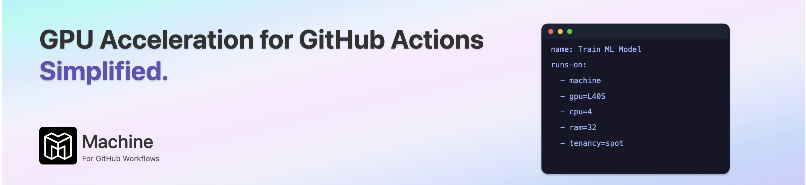

[](https://machine.dev/)

Machine supercharges your GitHub Workflows with seamless GPU acceleration. Say goodbye to
the tedious overhead of managing GPU runners and hello to streamlined efficiency. With Machine,
developers and organizations can effortlessly scale their AI and machine learning projects,
shifting focus from infrastructure headaches to innovation and speed.

# Language Model Arena

This repository enables easy comparison of open-weight Language Models using GPU-accelerated benchmarks via GitHub Actions powered by Machine. It leverages the [lm-evaluation-harness](https://github.com/EleutherAI/lm-evaluation-harness) to evaluate model performance across multiple reasoning and language tasks.

---

### ✨ **Key Features**

- **⚡ GPU Acceleration:** Quickly benchmark large language models using GPU power.
- **📊 Automated Benchmarking:** Easily compare two language models on a configurable set of tasks.
- **📈 Visualized Results:** Generate clear comparison charts automatically for straightforward analysis.
- **🌎 Global Efficiency:** Utilize spot-priced GPU instances globally, optimizing performance and cost.
- **🚀 Easy Customization:** Configure benchmarks, models, and computational resources through GitHub workflow inputs.

---

### 📁 **Repository Structure**

```
├── .github/workflows/
│   └── llm-eval-benchmark.yaml   # Workflow configuration
└── llm_benchmark_plotting.py     # Script for plotting benchmark comparisons
```

---

### ▶️ **Getting Started**

#### 1. **Use This Repository as a Template**
Click the **Use this template** button at the top of this page to quickly create your own benchmarking project.

#### 2. **Configure Your Benchmarking**
Adjust the workflow parameters directly in GitHub Actions:

```yaml
on:
  workflow_dispatch:
    inputs:
      model_1:
        type: string
        required: false
        description: 'The first model to benchmark'
        default: 'Qwen/Qwen2.5-3B-Instruct'
      model_1_revision:
        type: string
        required: false
        description: 'The first model revision to benchmark'
        default: 'main'
      model_2:
        type: string
        required: false
        description: 'The second model to benchmark'
        default: 'unsloth/Llama-3.1-8B-Instruct'
      model_2_revision:
        type: string
        required: false
        description: 'The second model revision to benchmark'
        default: 'main'
      tasks:
        type: string
        required: false
        description: 'The tasks to benchmark'
        default: 'hellaswag,arc_easy,mathqa,truthfulqa,drop,arc_challenge,gsm8k,mmlu_abstract_algebra,mmlu_college_mathematics'
      examples_limit:
        type: string
        required: false
        description: 'The number of examples to use for benchmarking'
        default: '100'
```

#### 3. **Run the Workflow**
- Manually trigger the workflow via GitHub Actions (**workflow_dispatch**).
- The workflow will execute on GPU-accelerated Machine runners.

```yaml
jobs:
  benchmark:
    name: LLM Eval Benchmarking
    runs-on:
      - machine
      - gpu=L40S
      - cpu=4
      - ram=32
      - architecture=x64
      - tenancy=spot
      - regions=us-east-1,us-east-2 # Optional region specification
```

#### 4. **Generate and Review Benchmark Results**
The workflow generates benchmark comparison charts:

```yaml
- name: Generate Benchmark Comparison Chart
  run: |
    ls -l ./benchmarks/
    python ./llm_benchmark_plotting.py
```

- Results, including JSON files and visual charts, will be uploaded as artifacts:

```yaml
- name: Upload Benchmark Artifacts
  uses: actions/upload-artifact@v4
  with:
    name: benchmark-results
    path: benchmarks/
    retention-days: 90
```

---

### 🔑 **Prerequisites**

- GitHub account
- Access to [Machine](https://machine.dev) GPU-powered runners

_No local setup required; all benchmarks run seamlessly through GitHub Actions._

---

### 📄 **License**

This repository is available under the [MIT License](LICENSE).

---

### 📌 **Notes**

- Benchmarks provided are designed to test reasoning capabilities across tasks like:
  - `hellaswag`, `arc_easy`, `mathqa`, `truthfulqa`, `drop`, `arc_challenge`, `gsm8k`, `mmlu_abstract_algebra`, and `mmlu_college_mathematics`.

- This repository is currently open for use as a template. While public forks are encouraged, we are not accepting Pull Requests at this time.

_For questions or concerns, please open an issue._
